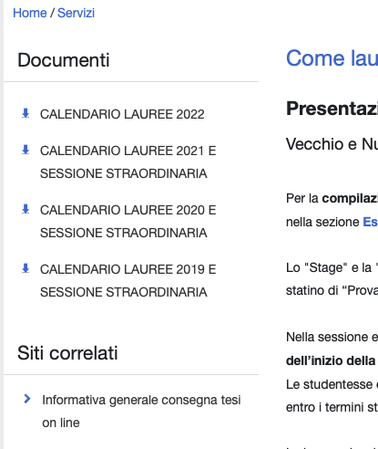

Guida fornita da [@Anzafilo](https://t.me/Anzafilo)
Link originale: https://barumba.notion.site/Come-laurearsi-28ca4749e3574767915941490d90afb8

# Come laurearsi?

Durante il lavoro di tesi/stage interno/esterno avrete della documentazione da firmare e far firmare al relatore che probabilmente avrete ricevuto dalla Castelli o dalla Gatti.

Documenti legati ad un modulo google compilato durante l’inizio o metà stage.

### Domanda di laurea

[Come laurearsi | Scuola di Scienze della Natura](https://www.scienzedellanatura.unito.it/it/servizi/come-laurearsi)

(sulla sidebar a sinistra compaiono dei file .excel con le date e scadenze per ogni sessione)

A domanda compilata ci si ritrova con questa schermata

Dovrebbe comparire il secondo pulsante a destra per inserire gli allegati (alcuni si fanno al volo o si hanno già, un’altro richiede uno scambio di mail e uno stampa-scan-firma digitale e l’allegato per la ricevuta tesi si avrà solo quando si farà lo step dopo della consegna tesi)

### Almalaurea

Cercano di inquadrarvi per il mercato con un form abbastanza lungo e a fine form potete o stampare direttamente la ricevuta del processo compilato o vi arriva per mail

[Login](https://www.almalaurea.it/en/login)

## Tesi

************************************************************Cosa succede durante lo sviluppo tesi************************************************************

### Doc tesi

**Frontespizio**

[Università di Torino](http://unito.it/didattica/esame-di-laurea)

Dal link passare alla sezione sotto e premere il bottone cerchiato

### Inserire un indice, nella pagina dopo il frontespizio

Alcuni software se azzecchi le testate di ogni sezione (le grandezze dei titoli e dei sottotitoli son coerenti su tutta la tesi) genera automaticamente un’indice organizzato

### ****************************************Dichiarazione di originalità (da inserire dopo l’indice o a fine tesi)****************************************

DICHIARAZIONE DI ORIGINALITÀ

**ITA**

"Dichiaro di essere responsabile del contenuto dell'elaborato che presento al fine del conseguimento del titolo, di non avere plagiato in tutto o in parte il lavoro prodotto da altri e di aver citato le fonti originali in modo congruente alle normative vigenti in materia di plagio e di diritto d'autore. Sono inoltre consapevole che nel caso la mia dichiarazione risultasse mendace, potrei incorrere nelle sanzioni previste dalla legge e la mia ammissione alla prova finale potrebbe essere negata."

**ENG**

"I declare to be responsible for the content I'm presenting in order to obtain the final degree, not to have plagiarized in all or part of, the work produced by others and having cited original sources in consistent way with current plagiarism regulations and copyright. I am also aware that in case of false declaration, I could incur in law penalties and my admission to final exam could be denied"

### Bibliografia

A fine tesi inserire libri-articoli-link usati per la laurea

esempio

**UPLOAD TESI sito ATENEO**

Generalmente a -10 giorni dalla data di laurea massimo

- --> ENTRO le ore 23.59 del giorno 4 aprile 2023 (IGNORATE eventuali date che compaiono nelle schermate unito) sul sito di Ateneo (con le credenziali SCU:[http://www.unito.it/servizi/la-laurea/tesi-line](http://www.unito.it/servizi/la-laurea/tesi-line)): mi raccomando non aspettate l'ultimo secondo, non fatevi rincorrere, a tarda ora non ci sarebbe nemmeno assistenza da Unito!

******************************************Warning: la Gatti suggerisce di passare da questo link perchè da altri link risultano bottoni rotti******************************************

[Tesi on line](https://www.unito.it/servizi/la-laurea/tesi-line)

Dal link scrollare fino a questa sezione e cliccare su consegna tesi

Nell'upload, l'annata e' quella della prima parte dell’anno, esempio anno 2021/22 scegli 2021, 2022/23 scegli 2022.

Gatti:

“Come insegnamento (come per la domanda di laurea), scegliete un insegnamento del vostro piano di studi che sia avvicinabile all'argomento di tesi, anche se non lo avete seguito con il vostro relatore: l'importante e' selezionare un insegnamento di settore INF/01 come il vostro relatore oppure MAT/09 (Grosso/Aringhieri) o altro MAT/nn (chiedetemi nel caso), o SECS/P08 (Pironti) o IUS/02 (Montalcini/Sacchetto) a seconda se il vostro relatore non sia di settore informatico come sono la maggior parte dei nostri docenti.

Oppure (vale solo per i triennali) si puo' anche selezionare la voce stage.”

## Giorno di laurea

Ci saranno delle fasce orarie su 1 o più giorni e probabilmente arriverà una mail dalla Gatti a riguardo

### Slide della laurea (PowerPoint)

Paola Gatti:

“Probabilmente vi faremo consegnare le presentazioni sul DataCloud del Dipartimento (normalmente la scadenza e' il giorno prima della seduta), ma vi inviero' indicazioni precise.”

In teoria son 10 minuti a testa, non penso ci sia troppo tempo per avere troppe slide. (ndr: 10 minuti in triennale, 25 in magistrale)

## Documentazione utile da scaricare

[Corso di Laurea in Informatica :: Accreditamento - Lista Documenti](http://laurea.educ.di.unito.it/index.php/accreditamento/consultazione/ListaDocumenti?commissione=9)

(se scrivete alla Gatti fuori orario d’ufficio, c’è un reply automatico con molti link di cui avrete bisogno)
